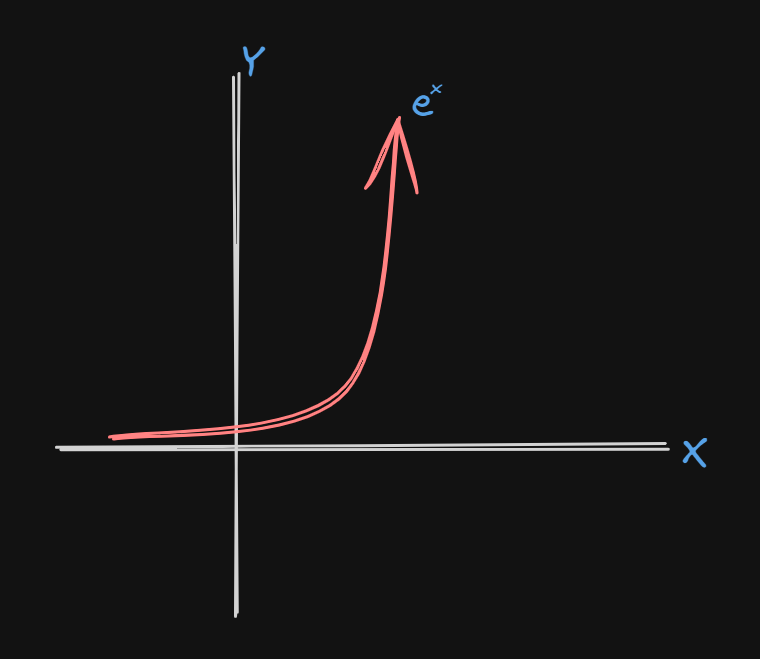
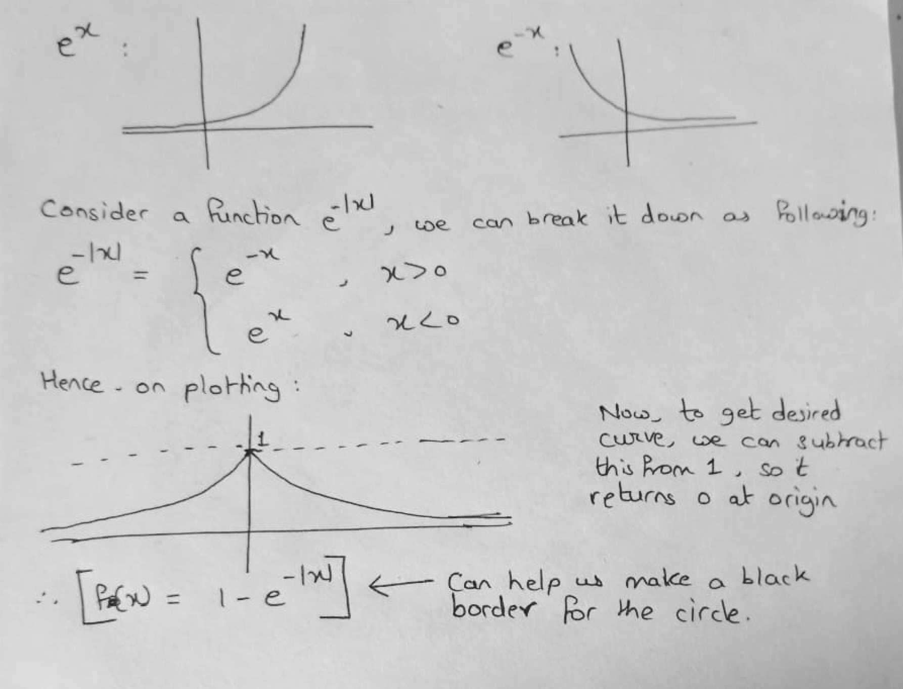
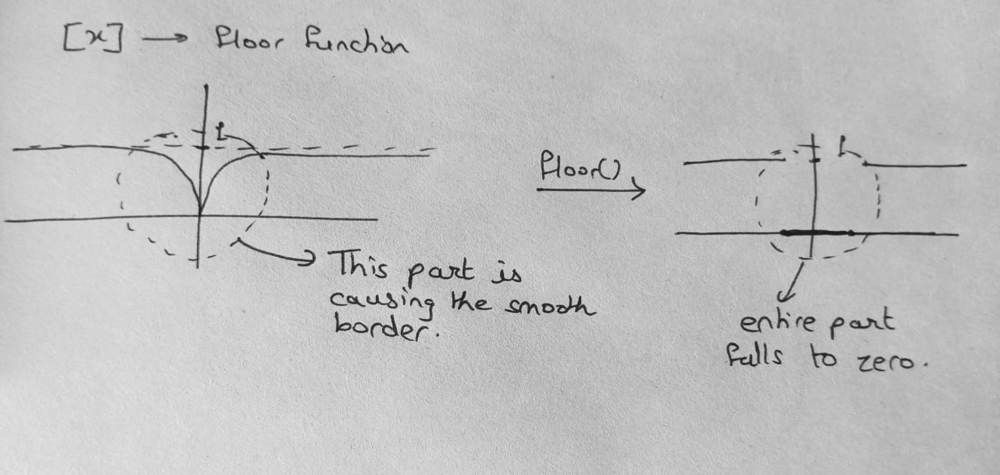
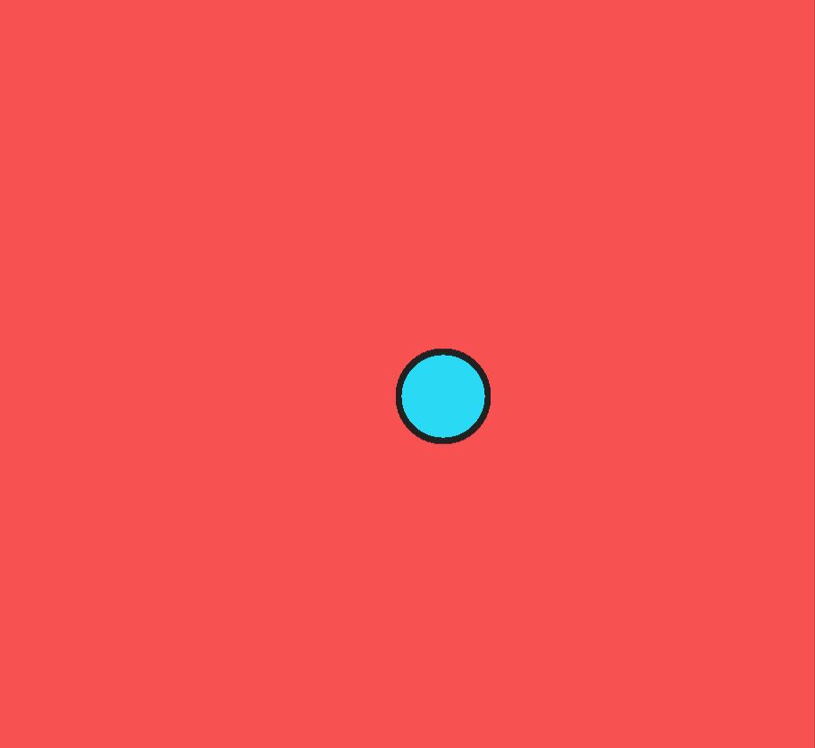

# Circle SDF

A circle can be defined in a very simple manner: **_A curve formed by joining all the points equidistant from a certain point._**

Hence, we can visually make a circle by coloring all the points that lie at a distance less than or equal to a radius from a point, and that'll give us a circle, pretty simple.

```glsl
precision mediump float;

uniform float u_time;
uniform vec2 u_resolution;

float sdfCircle(vec2 p, float r){
  return length(p) - r;
}

void main(){
    vec2 uv = gl_FragCoord.xy/u_resolution;
    uv = uv*u_resolution/100.0;

float radius = .5;
vec2 center = vec2(5.0,4.0);

float distanceToCircle = sdfCircle(uv-center, radius);

gl_FragColor = distanceToCircle > 0.0 ? vec4(0.0745, 0.0745, 0.0745, 1.0) : vec4(0.1647, 0.851, 0.9569, 1.0);
}
```
That gives this output as expected:


Now, to give it a border, we will use the **exponential function.**



In the graph of e^x or exponential function, we see that as x tends to negative infinity, e^x tends to zero. And as move at x=0, e^x is 1.
This nature of e^x function can be used to add border to our circle!

Now, we have to make necessary manipulations to this function to get our desired output.

## Adding a black border
We basically want a curve that returns 0 when the curve is at the origin, and tends to 1 as we move away from origin in both the direction.



According to the math, here is the updated code:

```glsl
precision mediump float;

uniform float u_time;
uniform vec2 u_resolution;

float sdfCircle(vec2 p, float r){
  return length(p) - r;
}
 
void main() {
    vec2 uv = gl_FragCoord.xy/u_resolution;
    uv = uv*u_resolution/100.0;

float radius = .5;
vec2 center = vec2(5.0,4.0);

float distanceToCircle = sdfCircle(uv-center, radius);

gl_FragColor = distanceToCircle > 0.0 ? vec4(0.9725, 0.3176, 0.3176, 1.0) : vec4(0.1647, 0.851, 0.9569, 1.0);
gl_FragColor = gl_FragColor*(1.0 - exp(-abs(50.0*distanceToCircle)));

}
```
Here, the _50_ I have multiplied is more like a contracting factor, which will contract the graph.
Now, we want to make the borders sharp. For that we can use the _floor_ function, or the _Greatest Integer Function_



Now, the output is:
